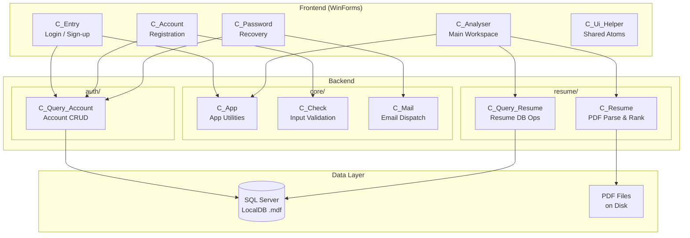

# Architecture Overview

## System Architecture

CV Analyser follows a **layered monolithic** architecture with clear separation between frontend, backend, and data layers.



---

## Module Descriptions

### Backend

| Module     | File               | Class             | Responsibility                                              |
| ---------- | ------------------ | ----------------- | ----------------------------------------------------------- |
| **core**   | `app.cs`           | `C_App`           | Browser launch, error display, app-level utilities          |
| **core**   | `check.cs`         | `C_Check`         | Email, phone, password, username validation                 |
| **core**   | `mail.cs`          | `C_Mail`          | SMTP email dispatch for password recovery codes             |
| **auth**   | `query_account.cs` | `C_Query_Account` | Account creation, login, update, delete via SQL             |
| **resume** | `resume.cs`        | `C_Resume`        | PDF text extraction (iTextSharp), keyword matching, scoring |
| **resume** | `query_resume.cs`  | `C_Query_Resume`  | Resume data persistence and retrieval                       |

### Frontend

| Module    | File           | Class         | Responsibility                                       |
| --------- | -------------- | ------------- | ---------------------------------------------------- |
| **atoms** | `ui_helper.cs` | `C_Ui_Helper` | Password visibility toggle (shared across forms)     |
| **pages** | `entry.cs`     | `C_Entry`     | Login form with username/email/phone + password      |
| **pages** | `account.cs`   | `C_Account`   | New account registration with validation             |
| **pages** | `password.cs`  | `C_Password`  | Password recovery via email verification code        |
| **pages** | `analyser.cs`  | `C_Analyser`  | Main workspace: load CVs, set keywords, rank, export |

---

## Data Flow

```
User selects folder
       │
       ▼
┌──────────────┐     ┌──────────────┐     ┌──────────────┐
│  Load PDFs   │────▶│  iTextSharp  │────▶│  Extract     │
│  from disk   │     │  PDF Parser  │     │  raw text    │
└──────────────┘     └──────────────┘     └──────┬───────┘
                                                  │
                                                  ▼
┌──────────────┐     ┌──────────────┐     ┌──────────────┐
│  Display     │◀────│  Rank by     │◀────│  Match       │
│  Top 3 + Grid│     │  score       │     │  keywords    │
└──────────────┘     └──────────────┘     └──────────────┘
       │
       ▼
┌──────────────┐
│  Export top   │
│  CVs to dir   │
└──────────────┘
```

---

## Key Design Decisions

| Decision                | Rationale                                                |
| ----------------------- | -------------------------------------------------------- |
| Monolithic architecture | Single desktop app, no need for microservices            |
| SQL Server LocalDB      | Zero-config database that ships with Visual Studio       |
| iTextSharp for PDF      | Mature, well-tested .NET PDF library                     |
| Atomic Design for UI    | Extracts shared components (atoms) to reduce duplication |
| Enterprise naming       | Consistent, scannable codebase for team collaboration    |
